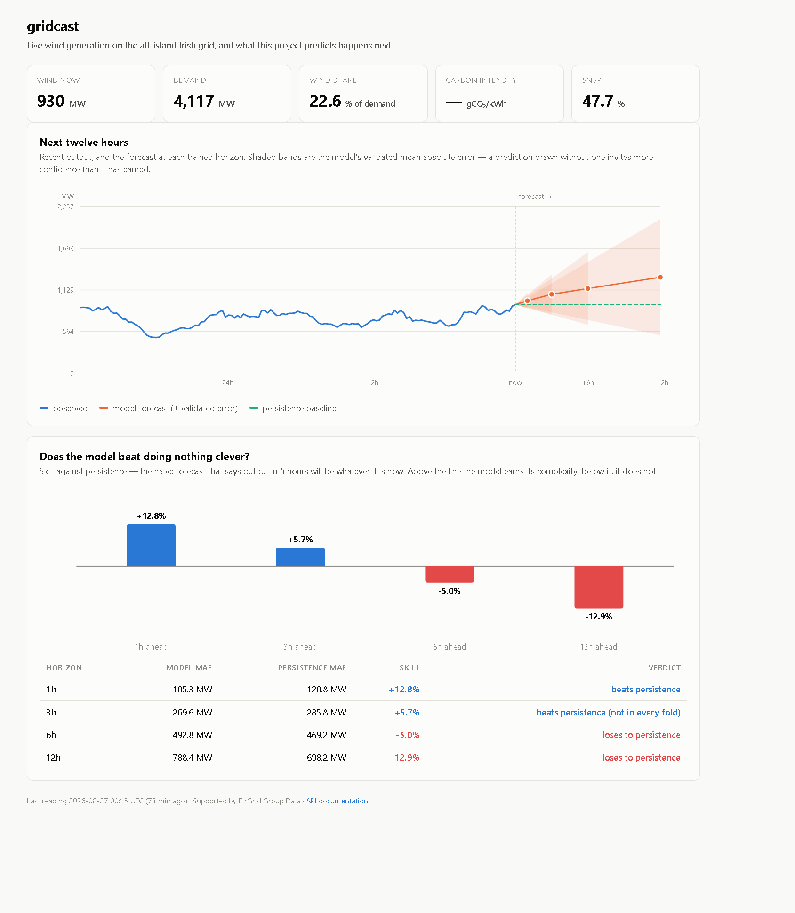
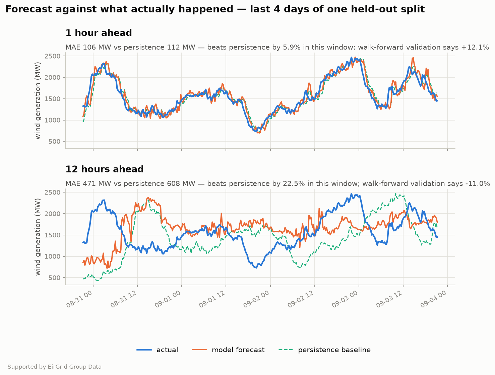
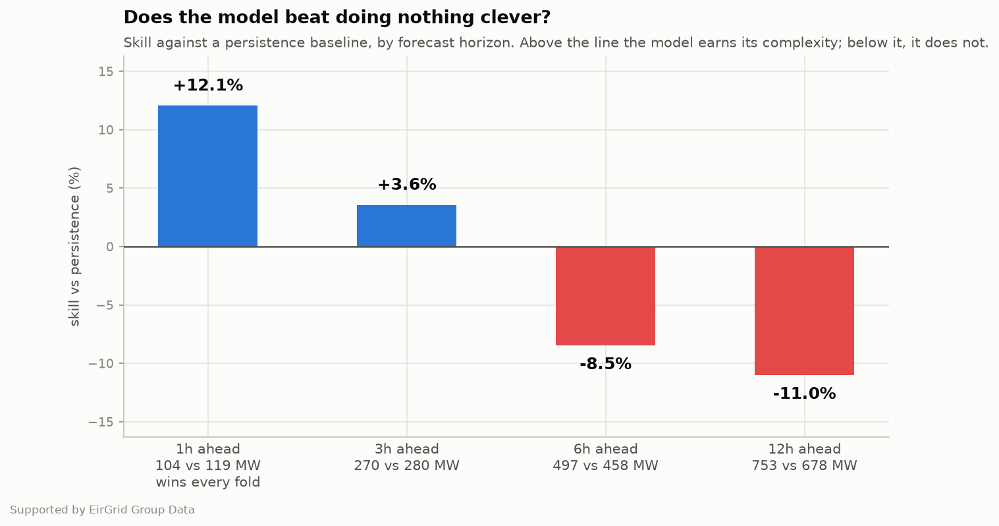
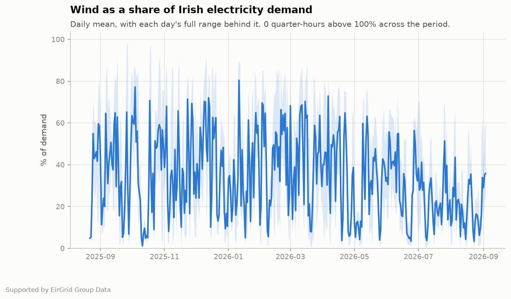
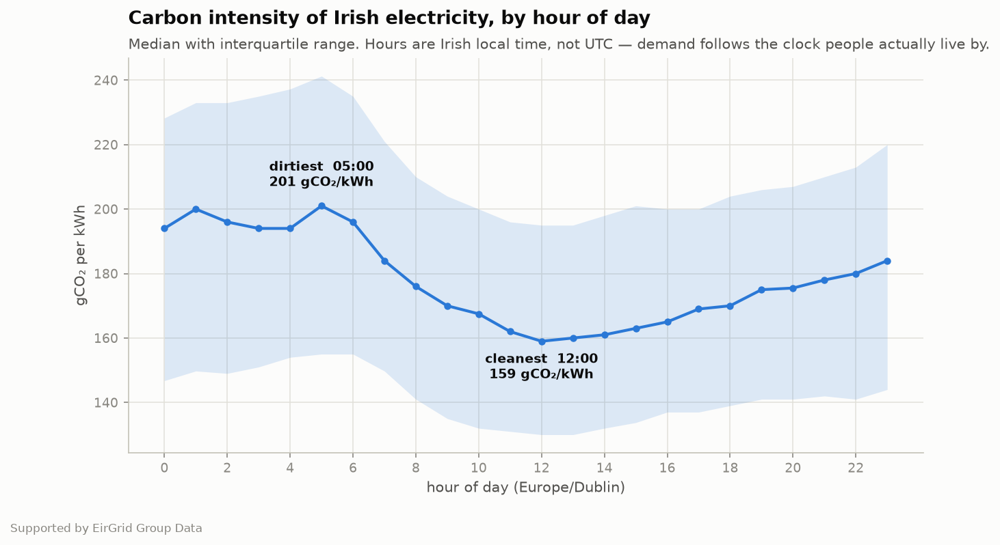

# gridcast

Ingests live data from the Irish electricity grid and forecasts short-term wind
generation.

Ireland runs one of the highest shares of wind power of any grid in the world.
That makes two questions worth asking, and this project is built to answer
them with data rather than assertion:

- **How much of demand does wind actually cover, and when is the grid at its dirtiest?**
- **Can wind output be forecast a few hours ahead well enough to be worth anything?**

The second question is the harder one, and the honest answer to it is the point
of the project. In short-horizon forecasting, "output in an hour will be about
what it is now" — a persistence baseline — is unreasonably difficult to beat.
Any model here is reported against that baseline at every horizon, including
the horizons where it loses.



---

## Results
A year of all-island data, 270,000+ readings. Models validated by walk-forward
cross-validation over five expanding folds, each scored against a persistence
baseline measured on exactly the same rows.

Completeness is reported by `gridcast status` rather than quoted here, because
it moves: the upstream dashboard returns 503 under load, and every refused
window leaves a gap until a later run fills it. A fixed number in a README is
the one that will be wrong.

| Horizon | Model MAE | Persistence MAE | Skill |
|---|---|---|---|
| **1 hour** | **104.4 MW** | 118.8 MW | **+12.1%, in every fold** |
| 3 hours | 270.1 MW | 280.1 MW | +3.6% |
| 6 hours | 497.2 MW | 458.2 MW | −8.5% |
| 12 hours | 752.9 MW | 678.1 MW | −11.0% (unstable — see below) |

**The model beats persistence at one hour and loses beyond three.** That shape
is the finding, and it is reported rather than hidden.

### Why it loses, and it is not the horizon

The obvious reading is that twelve hours is simply too far. The folds say
something more specific. Here is the six-hour horizon with each test window
mapped onto the calendar:

| Fold | Test window | Persistence MAE | Skill |
|---|---|---|---|
| 1 | 20 Jan – 06 Mar 2026 | 668.7 MW | +2.6% |
| 2 | 06 Mar – 20 Apr 2026 | 600.3 MW | −6.3% |
| 3 | 20 Apr – 05 Jun 2026 | 377.6 MW | −18.1% |
| 4 | 05 Jun – 20 Jul 2026 | 345.8 MW | −31.4% |
| 5 | 20 Jul – 03 Sep 2026 | 299.0 MW | **+1.0%** |

Persistence error falls steadily from winter into summer — 669 MW down to
299 MW — and the model's skill collapses in step with it. The model is not
getting worse. Persistence is getting better. Calm summer wind barely moves
between one reading and the next, so "assume nothing changes" becomes very
hard to beat, while a model trained mostly on volatile autumn and winter data
keeps predicting winter-sized swings and moves away from the right answer.

Fold 5 is the test of that explanation. It is still summer, but its training
set is the first to contain a summer — June and July 2026, which were fold 4's
test window. Skill recovers from −31.4% to +1.0% at six hours, and from −43.8%
to −15.2% at twelve. Absolute model error in fold 5 is the lowest of all five
folds. Given one summer to learn from, the model stops losing.

Seasonal coverage is therefore part of the story. It is not the whole of it,
and the next section is the part I got wrong first.

### The twelve-hour number is not precise enough to quote

An earlier run on eleven months of data contained a fold at −137.5%. When a
full year of data produced folds no worse than −43.8%, the obvious conclusion
was that more data had fixed it.

It had not. Training the same code inside the container — on a database
differing from the development one by about four days — produced a fold at
−89.7%. The catastrophic fold had not been removed. It had moved.

Three runs, same code, datasets within two weeks of each other:

| Horizon | 11 months | 377 days | 365 days | spread |
|---|---|---|---|---|
| **1 hour** | +12.0% | +12.1% | +11.8% | **0.3 pts** |
| 3 hours | +4.8% | +3.6% | +3.0% | 1.8 pts |
| 6 hours | −6.6% | −8.5% | −7.8% | 1.9 pts |
| **12 hours** | −26.8% | −11.0% | −20.5% | **15.8 pts** |

Worst single fold at twelve hours, across the same three runs: −137.5%,
−43.8%, −89.7%.

The one-hour figure is the same number three times over. The twelve-hour
figure moves by sixteen points depending on where five fold boundaries happen
to land, and its worst fold varies by a factor of three.

So skill degrades with horizon, and so does the *precision of the estimate of
that skill*. At one hour "beats persistence by 12%" is a measurement. At twelve
hours "loses by 11%" is a single draw from a wide distribution, and quoting it
to one decimal place implies a confidence the data does not support. The
headline table above reports it anyway, because the alternative is reporting
nothing, but it should be read as "loses, somewhere in the region of ten to
twenty-five per cent, on this sample" rather than as a number.

The seasonal explanation above still holds — persistence error genuinely falls
from 669 MW to 299 MW into summer in every run, and skill genuinely tracks it.
What does not hold is the claim that a year of data settled the twelve-hour
horizon. It did not, and the container caught it.

The backtest chart below is the same instability from a third direction. It
draws four volatile days from a single held-out split, and over those four days
the twelve-hour model beats persistence by 22.5% — against a validated −11.0%.
Both are correct measurements of different things, which is why the chart now
prints them side by side. Re-rendering it a few hours later moved the window
figure by four points and left the validated figure where it was


### What a year of data cannot fix

Past a few hours, wind output is determined by weather this dataset does not
contain — a front arriving, a pressure gradient shifting. Operational
forecasters feed numerical weather prediction in for exactly that reason, and
no amount of feature engineering recovers information that was never
collected. Persistence, meanwhile, has no parameters, so it cannot overfit, and
its relative advantage grows with horizon.

Permutation importance at one hour explains where the 12.1% comes from:

```
wind_now         571.84  ########################################
wind_ramp4         8.85  #
wind_lag24         3.09
interconnection    2.30
wind_lag12         2.21
```

Only two features matter, and one of them by a factor of sixty-five.
Persistence knows the current *level*; the model also knows which way output is
*moving*. That is the entire edge.

Run the same measurement at six hours and the shape falls apart:

```
wind_now         213.87  ########################################
wind_ramp4        30.88  #####
co2_intensity     17.76  ###
wind_lag24        15.07  ##
snsp               7.89  #
wind_share         6.99  #
doy_cos            6.39  #
```

`wind_now` loses nearly two thirds of its weight, `wind_ramp4` gains three and
a half times its own, and a long tail of context appears — carbon intensity,
yesterday's value at this hour, system non-synchronous penetration, and
`doy_cos`, which is day-of-year seasonality.

This is the same finding as the fold table, seen from the other side. At one
hour the model needs the present and nothing else. At six it has run out of
present and reaches for seasonal and system context instead — context it
learned almost entirely from autumn and winter. It is not failing at six hours
for want of signal. It is failing because the signal it leans on was measured
in the wrong season.

### The finding, drawn



At one hour the orange line sits on the blue one. At twelve it wanders — and
notice that it wanders *confidently*, holding a level the grid left hours ago.
Both panels share a y-axis on purpose; a separate scale per panel would make an
870 MW error look the same size as a 106 MW one.



The crossover is the result. Everything to the right of one hour is a model
losing to a forecast that has no parameters at all.

Both charts are produced by `python -m gridcast report`, from a model fitted on
the earlier part of the series and scored on the later part. A model plotted
against data it was trained on produces a beautiful chart that proves nothing.

### What the data itself says

- **Wind covered 34.1% of Irish demand on average, and peaked at 98.6%** — there
  was a moment last year when wind was generating almost the whole country's
  electricity.
- The grid is **dirtiest at 05:00** (202 gCO2/kWh) and **cleanest at 12:00**
  (164), in Irish local time. Counterintuitive until you notice that overnight
  demand collapses while must-run thermal plant stays on, so its share of the
  mix rises even as total emissions fall. Measured in UTC the same profile
  reads 04:00 and 11:00 — an hour out from the human behaviour causing it,
  which is why the analysis converts.
- A seasonal-naive forecast — *yesterday at this time* — is **worse than
  predicting the long-run mean**. Wind has essentially no daily cycle, which is
  the opposite of demand on the same grid.



The pale band is each day's full range, and it is the point of the chart. A day
averaging 40% still contains hours near zero and hours above 100, and that
spread — not the average — is what makes wind hard to operate around.



Hours here are Irish local time, not UTC. Carbon intensity moves with when
people cook dinner, and through the summer a UTC label would put the evening
peak an hour away from the behaviour causing it.

---

## Data source

[EirGrid Smart Grid Dashboard](https://www.smartgriddashboard.com/), which
publishes the all-island system at roughly 15-minute resolution.

| Series | Unit | Why it is here |
|---|---|---|
| `demand` | MW | Total system demand |
| `wind` | MW | Metered wind generation — the forecast target |
| `generation` | MW | Total generation, all sources |
| `co2_intensity` | gCO2/kWh | Carbon intensity of what is being generated |
| `snsp` | % | System Non-Synchronous Penetration |
| `interconnection` | MW | Net interconnector flow, positive is import |

`snsp` earns its place. EirGrid operates to a ceiling on non-synchronous
penetration for stability reasons, which means wind is sometimes curtailed
*while it is windy*. A model that only sees wind and weather cannot explain
those hours; one that sees SNSP can.

### Licence and attribution

Data is used under the
[EirGrid Group Open Data Licence](https://www.smartgriddashboard.com/hr/open-data-license/),
which permits reuse, adaptation and republication, commercially and
non-commercially, subject to attribution.

**Supported by EirGrid Group Data**

The licence also reserves EirGrid's right to throttle access where they believe
excessive use is degrading the service. Every rate limit, chunk size and backoff
setting in `gridcast/config.py` exists because of that clause. The client is
synchronous and waits between requests on purpose.

Code in this repository is MIT licensed. The data is not mine to relicense.

---

## Quick start

```bash
git clone https://github.com/Husnain-Yaqoob/gridcast.git
cd gridcast

python -m venv .venv
source .venv/bin/activate        # Windows: .venv\Scripts\activate
pip install -e ".[analysis,dev]"

python -m gridcast probe         # is the service answering?
python -m gridcast backfill --days 365
python -m gridcast status
```

`probe` first, always. The dashboard endpoint returns `503` when it is busy —
that happened during development — and it is worth knowing that before starting
a backfill rather than halfway through one.

### Commands

| Command | What it does |
|---|---|
| `probe` | Checks the service answers, writes nothing |
| `backfill --days N` | Loads N days of history for every series |
| `update` | Fetches whatever has appeared since the last run |
| `status` | What is held, how complete it is, how recent runs went |
| `baseline` | Scores the naive forecasts, by horizon |
| `train` | Trains and validates a model per horizon against persistence |
| `importance` | Which features the model actually relies on |
| `forecast` | Predicts from the most recent data held |
| `report` | Renders the charts above into `docs/` |
| `serve` | Runs the forecast API and the live dashboard |

The project also ships a `Dockerfile` and a `docker-compose.yml` — see [Docker](#docker).

Add `-v` to watch each request.

### The API

```bash
pip install -e ".[api]"
python -m gridcast serve
```

Live dashboard at `http://127.0.0.1:8000/dashboard`, interactive API
documentation at `/docs`.

| Endpoint | Returns |
|---|---|
| `GET /health` | Liveness, which models are loaded, cache age |
| `GET /horizons` | What can be forecast, and how each scored in validation |
| `GET /latest` | Most recent observed grid state |
| `GET /history?hours=36` | Recent observed readings, oldest first |
| `GET /forecast?horizon=1` | A prediction, with its validated error and skill |
| `GET /dashboard` | The live page above, for people rather than programs |

```json
{
  "made_at_utc": "2026-08-23T22:15:00Z",
  "valid_at_utc": "2026-08-23T23:15:00Z",
  "horizon_hours": 1.0,
  "predicted_wind_mw": 470.2,
  "current_wind_mw": 450.0,
  "expected_error_mw": 105.6,
  "persistence_error_mw": 119.9,
  "skill_vs_persistence_pct": 12.0,
  "attribution": "Supported by EirGrid Group Data"
}
```

### Keeping it current

`update` is designed to be run on a schedule — every hour is ample for a source
that publishes every fifteen minutes.

**Linux/macOS** — `crontab -e`:

```
15 * * * * cd /path/to/gridcast && .venv/bin/python -m gridcast update
```

**Windows** — Task Scheduler, hourly, running `python -m gridcast update` with
the repository as the working directory.

---

## Docker

```bash
docker compose up -d api
```

Then `http://127.0.0.1:8000/dashboard`.

A fresh stack has no data and no models, so the first run of the API will tell
you so and stop. Fill it first:

```bash
docker compose run --rm backfill     # hours, resumable, safe to interrupt
docker compose run --rm train        # writes the models the API loads
docker compose up -d api
```

| Command | What it does |
|---|---|
| `docker compose up -d api` | Serves the API and dashboard on `127.0.0.1:8000` |
| `docker compose run --rm update` | Fetches whatever is new |
| `docker compose run --rm backfill` | First load of a year of history |
| `docker compose run --rm train` | Retrains and saves the models |
| `docker compose run --rm status` | What is held, and how recent runs went |

The API loads its models once at startup, deliberately, so after `train` it
needs `docker compose restart api` before it serves the new ones.

Four decisions in there are worth the sentence each.

**The database and the models are volumes, never image layers.** Both are
artifacts rather than source. Baking a year of readings into an immutable image
gives every container a private copy of data that is stale the following day,
and grows the image every time the data does. `gridcast-data` and
`gridcast-models` outlive any container, so the ingest job writes to exactly
the storage the API reads from.

**`--host 0.0.0.0`, and this one catches people out.** The CLI defaults to
`127.0.0.1`, which is right on a laptop and useless in a container: it binds
the container's own loopback, so the published port connects to nothing and a
perfectly healthy service looks broken.

**The port is published to `127.0.0.1`, not to everything.** `"8000:8000"`
would expose this to the internet on any machine with a public IP, past the
host firewall — Docker writes its own iptables rules and does not consult it.

**Only `api` starts by default.** The ingest services sit behind a compose
profile so that `docker compose up` cannot quietly fire a fetch at EirGrid on
every restart. Their open data licence asks people not to form that habit.

The image installs the `serve` extra rather than `analysis`: the service loads
models and answers requests, and never draws a chart, so matplotlib and its
font and image libraries stay out of it. Charts are rendered by
`gridcast report` on a developer machine.

None of the tests build an image — that needs a daemon, and a suite that only
passes on machines with one is a suite people stop running. What they do check
is drift: every command in `docker-compose.yml` is parsed by the real CLI
parser, and every service that writes to a path is checked to have a volume
behind it. A container that runs, reports rows written, exits zero and loses
the database is the failure that looks like success.

---

## Design decisions

These are the choices that took thought. They are recorded because the
reasoning is more useful than the code.

### Charts are held to the same standard as the numbers

Two rules, both easy to break by accident.

**A forecast is plotted at the time it is *for*, not the time it was made.** A
twelve-hour forecast made at noon is a statement about midnight. Drawing it at
noon shifts the whole line half a day left of the reality it is predicting,
which produces a chart that looks wrong in a way nobody can quite name. There
is a test asserting that each row's `actual` value is the reading the database
actually holds for that row's timestamp.

**The model never sees the period it is drawn against.** `report.backtest()`
fits on the earlier part of the series and predicts the later part,
chronologically — never a random split, which on a quantity this
autocorrelated would let the model train on Thursday and be tested on
Wednesday. Plotting a model against its own training data is one of the most
common ways a portfolio project quietly misleads, and it is invisible in the
finished picture.

The dashboard follows from the same idea. It has no build step, no framework
and no external requests — partly so it works on a laptop with no internet, and
partly because every number on it is fetched from this project's own API. If
the hourly ingest stops, the page says so in red rather than continuing to show
a reassuring picture of yesterday.

### A null is not a zero

EirGrid publishes rows with a null value for periods that have not settled and
for gaps in metering. Those nulls survive parsing, storage and querying as
nulls.

Coercing them to zero would say the wind stopped blowing. On a grid where wind
routinely covers a third of demand, that is not a rounding error — it is a
fabricated blackout, and a model trained on it learns that output collapses to
nothing at predictable times. There is a test for every marker the service has
been seen to use, and a separate test asserting that a *genuine* measured zero
is preserved, because wind output really can be near zero on a still night.

### Everything is stored in UTC

The API speaks Irish local time. Ireland observes daylight saving, so one hour
in October occurs twice and one hour in March does not occur at all.

Lag features computed over a series stored in local time are wrong twice a
year, in a way that is nearly invisible in a chart and completely invisible in
a summary statistic. Conversion happens once, at the boundary, in `models.py`.

### The load is idempotent

The fact table's primary key is `(area, region, ts_utc)`, and writes are
`INSERT ... ON CONFLICT DO UPDATE`. Running the pipeline twice produces the
same database, not two copies of every reading.

This is enforced by the database rather than by remembering to be careful,
because a scheduled job *will* be run twice — retried after a timeout, or
kicked off by hand by someone who forgot cron had already done it.

A later fetch overwrites an earlier one deliberately: EirGrid revises
provisional figures as metering settles, so the newest answer is the most
correct one.

### The watermark ignores nulls

Incremental updates ask each series "what is the newest reading you hold *with
a value*?" — not simply the newest row.

If it counted the null placeholder rows, the pipeline would consider itself up
to date, resume from after the gap, and never go back for the real values once
they settled. That leaves a permanent hole that nothing reports.

### Each series carries its own watermark

Carbon intensity has been seen to lag wind by a settlement period. A single
global watermark would either re-fetch everything every run or silently skip
whichever series lags.

### We got throttled, and the fix was to ask less

The first full backfill was rate-limited. `demand` completed fifteen weekly
windows and then started receiving `403`. `wind` managed six before the same
thing happened, `generation` one. Each series got fewer successes than the one
before it — the signature of a token bucket draining faster than it refills.

The licence reserves EirGrid's right to do exactly this, so the response was to
be less demanding rather than more persistent. Three changes:

**Bigger windows.** Four weeks per request instead of one. A month of
quarter-hourly data is about 2,900 rows — a comfortable response — and it cuts
a year-long backfill from 318 requests to 84. Fewer moderate requests is
gentler on a service than many small ones, and this is the change that mattered
most.

**A longer gap.** Five seconds between requests rather than 1.5.

**403 treated as throttling, not refusal.** A `403` here does not mean "you may
never have this" — the identical request succeeds a minute later. It means "you
have asked too often". Retrying it on a two-second backoff is both useless and
rude, so the client waits two minutes, then four, then six, and gives up on the
series after three cool-downs rather than hammering away.

### The fetch ledger, so a re-run resumes

`fetch_log` records every window successfully retrieved. A backfill skips
windows already in it.

Without this, being throttled is unrecoverable in practice: every re-run
re-requests the same early months, gets cut off at roughly the same point, and
never reaches the later ones no matter how many times it is run. With it, each
attempt makes progress and the backfill completes across as many runs as it
takes.

The ledger is deliberately separate from the readings themselves. "I asked for
October and October was genuinely empty" and "I never asked for October" are
different facts, and counting rows cannot distinguish them.

One exception: a window running up to today is never recorded as complete,
because the rest of today has not been published yet. Marking it done would
freeze the series at that moment and no later run would revisit it.

`--fresh` ignores the ledger and re-requests everything, for when the stored
data is suspect.

### Work is committed as it arrives

A backfill makes over three hundred requests across twenty minutes. Each
weekly chunk is written to the database the moment it lands, rather than
accumulating a year in memory and writing once at the end.

The first version did the latter, and the first real backfill proved why that
was wrong: it was interrupted partway through the third series, and every
request made up to that point was discarded. Twenty minutes of politely-rate-
limited fetching, an empty database, and nothing to show for it.

Stopping the job now keeps everything already fetched, and re-running continues
from where it stopped — which the idempotent upsert already made safe.

### Ctrl+C is handled, because it is not an Exception

`KeyboardInterrupt` inherits from `BaseException`, not `Exception`, so a broad
`except Exception` never sees it. The process died where it stood and left an
open row in the run log with no finish time, which reads forever afterwards as
"this job is still running".

It is now caught explicitly, recorded as `cancelled`, and exits with code 130.

### 503 is retried, 404 is not

A `503` from this service means *busy*, not *gone*, so it is retried with
widening backoff. A `404` will still be a `404` in four seconds, so it fails
immediately.

That distinction was originally a bug: `raise_for_status()` throws `HTTPError`,
which is a subclass of `RequestException`, so the first version of the retry
loop caught it and cheerfully retried permanent failures four times. A test
caught it.

### interconnection is published per jurisdiction

Every other series returns all-island rows. `interconnection` returns separate
ROI, NI and ALL rows whatever region is requested — East-West lands in ROI,
Moyle in NI.

The parser keeps whatever region each row declares, so the database holds all
three. That is more data, not wrong data, but any pivot must filter on region
or those timestamps triple and every join is quietly corrupted.

### SNSP is half-hourly, and filled by exactly one step

SNSP is published every 30 minutes where the rest are quarter-hourly, so on the
model's index every other SNSP slot is empty. It is forward-filled by one step
and no more.

One step asserts that the SNSP measured at 10:00 still applied at 10:15, which
is true of a quantity that moves slowly. An unlimited fill would assert that
the last reading before a three-day outage applied for three days — invention
dressed up as data.

### No feature may see the future

Everything in `features.py` is a fact about the present or the past. The target
is shifted backwards rather than the features forwards, so every row stays
anchored to the moment the forecast is made.

There is a test that corrupts all data after a cut point and asserts no feature
value at or before the cut moves. Leakage is the one bug that makes a model
look *better*, which is why it survives into so many finished projects.

### Time of day is encoded on a circle

Hour 23 and hour 0 are adjacent in reality. As plain integers they are
twenty-three apart, and a model is told midnight is the opposite of 11pm.
Sine/cosine pairs put them next to each other, where they belong.

### Validation walks forward, and always reports the baseline

Splits are expanding-window: train strictly on the past, test strictly on the
future. A random split lets a model learn from Thursday to predict Wednesday,
which raises the score and destroys the forecast.

Every horizon is reported against a persistence baseline — "output will not
change" — including the horizons where a model loses to it. At one hour ahead
persistence is genuinely hard to beat; by six hours it degrades enough that
even the long-run mean overtakes it. That crossover is a finding, and hiding it
would make the numbers meaningless.

### One model per horizon, not one model with a horizon input

Predicting one hour ahead and twelve hours ahead are different problems. At one
hour, current output dominates and little else matters. At twelve, current
output is nearly irrelevant and the model must lean on season, time of day and
recent variability. A single model forced to serve both learns a compromise
that is good at neither.

### The baseline is scored on exactly the same rows as the model

Within each fold, persistence is evaluated on that fold's test set — not on the
whole series, and not on a different sample. Comparing a model measured on one
set of rows to a baseline measured on another is not a comparison, however
favourable the numbers look.

### The headline MAE is weighted by rows

Folds differ in size, because the training window expands. Averaging the
per-fold MAEs would overweight the smallest fold; weighting by row count gives
the error an average prediction actually carries.

### Winning on average is reported separately from winning every time

A model that wins overall but loses in two folds out of five is not reliably
better — it caught a favourable stretch of weather. `train` marks that case, so
the headline number is never quoted without it.

### Missing values are passed to the model, not imputed

The gradient booster handles NaN natively. The auxiliary series have real gaps,
and filling them would invent readings the grid never published. Letting the
model learn "this was missing" is both more honest and more accurate.

### The model ships with a manifest

Every saved model writes a JSON file recording its horizon, the exact feature
columns it expects, how many rows it trained on, and its validation scores. A
`.joblib` on disk with none of that is an object nobody can safely use six
months later.

### The API returns the status code that describes the failure

A horizon with no trained model is a `404` — that resource genuinely does not
exist, and the body names the horizons that do. A database with no usable data
is a `503` — the service is temporarily unable to answer and the caller should
retry. A horizon of zero or 100 is a `422`, rejected by validation before any
work happens.

Plenty of APIs answer everything with `200` and hide the problem in the body.
That makes failure invisible to monitoring, to retry logic and to every
automated caller. "It returned a response" is not "it worked".

### Models load once, data is cached with a deadline

Deserialising a gradient booster takes a noticeable fraction of a second, so
doing it per request would turn a 5ms response into a 300ms one for a file that
has not changed.

The data frame is different: it *does* change, hourly. So it is cached for five
minutes rather than forever — fresher than the source can possibly be, without
re-reading 35,000 rows on every call. Caching it indefinitely would serve a
forecast anchored to yesterday while claiming to be current.

### Every forecast ships with its own error bar

The response carries the model's validated MAE, the persistence MAE it was
measured against, and the skill between them. A prediction without an error bar
invites false confidence, and one without its baseline cannot be judged at all.

### SQLite, not a server

This pipeline runs on a laptop and collects a few thousand rows a day. A
dependency on a running database server would make "does it work on your
machine" a real question for anyone cloning it. The `Store` class is the only
thing that would change if it outgrew this.

---

## Layout

```
gridcast/
├── gridcast/
│   ├── config.py     endpoints, series definitions, rate limits
│   ├── models.py     Reading, and the parsing that produces it
│   ├── client.py     HTTP access, retries, chunking
│   ├── store.py      SQLite storage and idempotent upsert
│   ├── ingest.py     orchestration and run logging
│   ├── frame.py      readings -> a regular, modellable time series
│   ├── features.py   lags, ramps, calendar encodings
│   ├── evaluate.py   baselines and walk-forward validation
│   ├── model.py      training, validation, saving, forecasting
│   ├── api.py        FastAPI service
│   └── cli.py        command line
├── tests/            149 tests, no network access required
└── data/             the database lives here (gitignored)
```

Tests never touch the network. A suite that needs the internet fails on a
train, and one that hits a public service on every run is precisely what the
fair-use clause is about.

```bash
python -m pytest
```

---

## Roadmap

- [x] Ingestion, storage, scheduling, run logging (chunk-by-chunk commits, resumable)
- [x] Feature engineering — lags, rolling means, ramp rates, hour and season
- [x] Persistence baseline, evaluated with walk-forward validation
- [x] Forecast models at +1h, +3h, +6h and +12h, reported against that baseline
- [x] FastAPI service exposing predictions
- [x] Dashboard: wind share of demand, carbon intensity by hour, forecast vs actual
- [x] Docker

Not built, and worth being explicit about why:

- **Numerical weather prediction as an input.** The six- and twelve-hour models
  fail for want of information this dataset does not contain. That is a data
  problem, not a modelling one, and no amount of feature engineering recovers
  it.
- **Prediction intervals** rather than a single number carrying a validated
  MAE.
